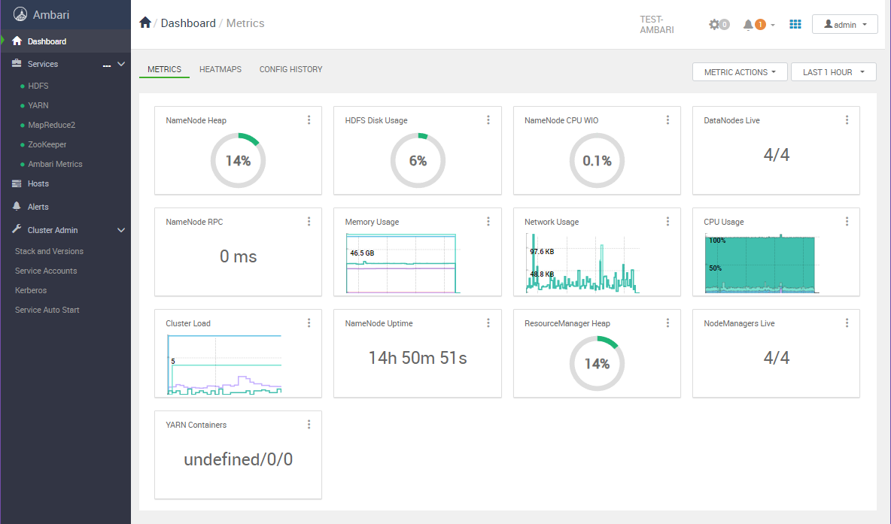
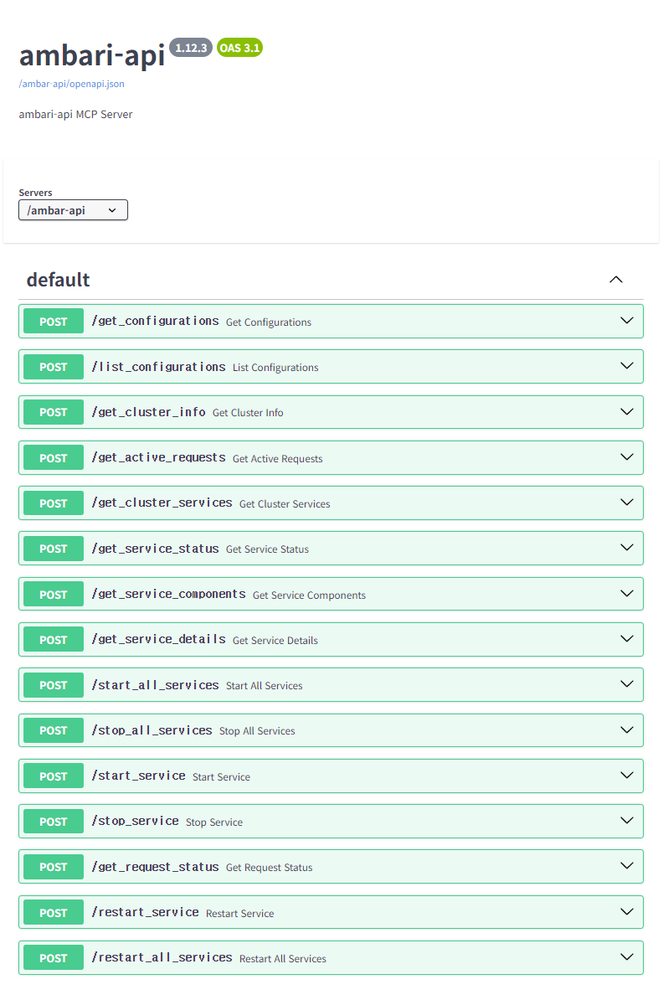
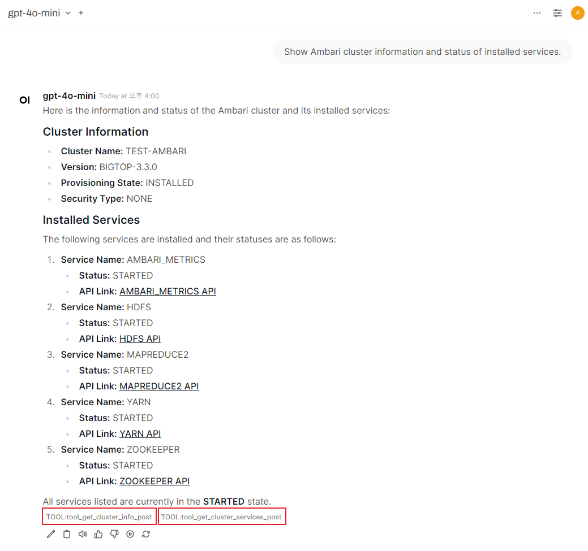

# MCP Ambari API

Model Context Protocol (MCP) server for Apache Ambari API integration. This project provides tools for managing Hadoop clusters, including service operations, configuration management, status monitoring, and request tracking.

## Features

- Manage Hadoop services (start, stop, restart)
- Monitor service and cluster status
- Retrieve and update configurations
- Track request progress

## Main Tool File

The main MCP tool file is located at `src/mcp_ambari_api/ambari_api.py`.

## How To Use

Using this Ambari API integration is very simple and straightforward. If you already have an MCP Tools environment running, just add the following configuration to your `mcp-config.json` file:

```json
{
  "mcpServers": {
    "ambar-api": {
      "command": "uvx",
      "args": ["--python", "3.11", "mcp-ambari-api"],
      "env": {
        "AMBARI_HOST": "host.docker.internal",
        "AMBARI_PORT": "8080",
        "AMBARI_USER": "admin",
        "AMBARI_PASS": "admin",
        "AMBARI_CLUSTER_NAME": "TEST-AMBARI"
      }
    }
  }
}
```

## Self QuickStart (Demo): Setting Up MCP Tools Environment with Docker

This section describes how to set up the MCP Tools environment to control an Ambari cluster using OpenWebUI and MCPO, leveraging the provided `docker-compose.yml` and `Dockerfile`.

### 1. Prepare Ambari Cluster (Test Target)

To set up a Ambari Demo cluster, follow the guide at:
https://medium.com/@call518/install-ambari-3-0-with-docker-297a8bb108c8


Once your Ambari cluster is ready, check the following environment variables in your `mcp-config.json` file:

```json
"AMBARI_HOST": "host.docker.internal",
"AMBARI_PORT": "8080",
"AMBARI_USER": "admin",
"AMBARI_PASS": "admin",
"AMBARI_CLUSTER_NAME": "TEST-AMBARI"
```
Make sure these values match your Ambari cluster setup.

### 2. MCP Tools Environment Setup

1. Ensure Docker and Docker Compose are installed on your system.
2. Clone this repository and navigate to its root directory.
3. Start the OpenWebUI and MCPO-Proxy environment:
   ```bash
   docker-compose up -d
   ```

- OpenWebUI will be available at the port specified in your `docker-compose.yml` (default: 3000 or as configured). You can access OpenWebUI at: [http://localhost:3000](http://localhost:3000)
- The MCPO-Proxy will be accessible for API requests and cluster management, and its port is also specified in your `docker-compose.yml` (default: 8000 or as configured).
- The list of MCP tool features provided by `src/mcp_ambari_api/ambari_api.py` can be found in the MCPO API Docs: [http://localhost:8000/ambar-api/docs](http://localhost:8000/ambar-api/docs)


### 4. Registering the Ambari-API MCP Tool in OpenWebUI

After logging in to OpenWebUI with an admin account, go to "Settings" → "Tools" from the top menu.
Here, enter the Ambari-API address (e.g., `http://localhost:8000/ambari-api`) to connect MCP Tools with your Ambari cluster.

### 5. Example: Using MCP Tools to Query Ambari Cluster

Below is an example screenshot showing how to query the Ambari cluster using MCP Tools in OpenWebUI:



## License

This project is licensed under the MIT License.